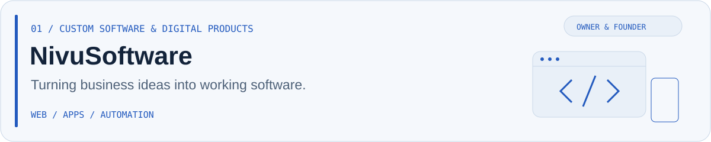
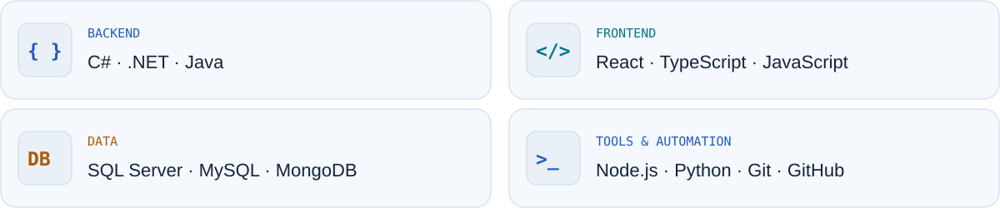

<picture>
  <source media="(prefers-color-scheme: dark)" srcset="./hero-dark.svg">
  
</picture>

  <a href="https://www.nivusoftware.com/">NivuSoftware ↗</a> &nbsp; · &nbsp;
  <a href="https://watones.net">Watones ↗</a> &nbsp; · &nbsp;
  <a href="https://teramont.net">Teramont ↗</a> &nbsp; · &nbsp;
  <a href="https://linkedin.com/in/emilio-albornoz-a38ba0246/">LinkedIn ↗</a>

### The engineer. The founder. The person behind the product.

I'm **Emilio**, a software engineer and the owner and founder of **NivuSoftware, Watones Network and Teramont Host**. Based in **Quito, Ecuador**, I work where software development, community building and infrastructure meet.

My work goes from **building web applications and backend systems** to **running gaming platforms and hosting services**. I care about the whole journey: the idea, the implementation and how it behaves in production.

## Three ventures. One builder.

<a href="https://www.nivusoftware.com/">
<picture>
  <source media="(prefers-color-scheme: dark)" srcset="./nivu-dark.svg">
  
</picture>
</a>

**Software for real business needs.** Through NivuSoftware, I work on websites, custom applications, business systems and automation — bringing product thinking and technical execution together.

[Website](https://www.nivusoftware.com/) · [GitHub organization](https://github.com/NivuSoftware)

<a href="https://watones.net">
<picture>
  <source media="(prefers-color-scheme: dark)" srcset="./watones-dark.svg">
  
</picture>
</a>

**A community powered by engineering.** A Minecraft network for Latin American players, combining custom systems, Java development, network operations and continuous performance improvements.

[Website](https://watones.net) · [Community](https://discord.gg/watones) · [GitHub organization](https://github.com/Watones)

<a href="https://teramont.net">
<picture>
  <source media="(prefers-color-scheme: dark)" srcset="./teramont-dark.svg">
  
</picture>
</a>

**Infrastructure that supports the product.** Hosting services for developers, creators and businesses, spanning game servers, websites, VPS and bare metal. My focus includes platform development and service architecture.

[Website](https://teramont.net)

## The tools behind the work

<picture>
  <source media="(prefers-color-scheme: dark)" srcset="./stack-dark.svg">
  
</picture>

Explore my stack and focus areas

| Area | Technologies & focus |
| :--- | :--- |
| Backend | C# · .NET · Java · Node.js · APIs |
| Frontend | React · TypeScript · JavaScript |
| Data | SQL Server · MySQL · MongoDB |
| Operations | Hosting · Minecraft infrastructure · Performance tuning |
| Automation | Python · Internal tools · Workflow automation |
| Development | Git · GitHub · VS Code |

## From the first idea to production

**Build with purpose.** Understand the problem, then create the software that solves it.  
**Run it well.** Keep performance, stability and maintainability part of the work.  
**Keep improving.** Use real feedback to shape the next iteration.

## Let's build something useful.

[Connect on LinkedIn](https://linkedin.com/in/emilio-albornoz-a38ba0246/) · [Explore NivuSoftware](https://www.nivusoftware.com/) · [Instagram](https://www.instagram.com/emilioo.albornozz)  
**Discord:** `osccar`

Software engineer by craft. Founder by mindset.
