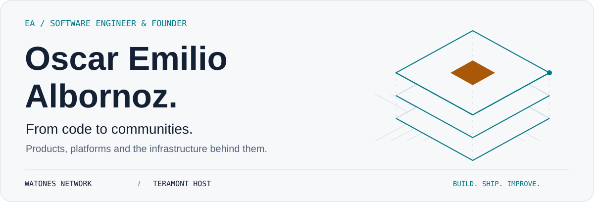
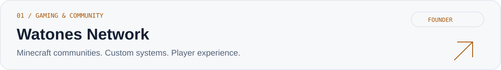
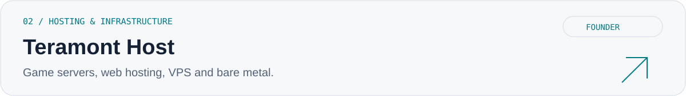

<picture>
  <source media="(prefers-color-scheme: dark)" srcset="./hero-dark.svg">
  
</picture>

  <a href="https://watones.net">Watones Network ↗</a> &nbsp; · &nbsp;
  <a href="https://teramont.net">Teramont Host ↗</a> &nbsp; · &nbsp;
  <a href="https://linkedin.com/in/emilio-albornoz-a38ba0246/">LinkedIn ↗</a>

## Engineering with an owner's mindset.

I'm **Emilio**, a software engineer and founder working across web applications, gaming platforms and hosting infrastructure.

I build the software, work on the systems behind it, and keep improving the experience people actually use. My focus is on **backend development, performance, automation and product execution**.

## Selected ventures

<a href="https://watones.net">
  <picture>
    <source media="(prefers-color-scheme: dark)" srcset="./watones-dark.svg">
    
  </picture>
</a>

A Minecraft network for a Latin American community. My work spans custom development, network infrastructure, performance tuning and the ongoing evolution of the player experience.

**Focus:** Java · Minecraft platforms · Stability · Community growth  
**Explore:** [Website](https://watones.net) · [Community](https://discord.gg/watones)

<a href="https://teramont.net">
  <picture>
    <source media="(prefers-color-scheme: dark)" srcset="./teramont-dark.svg">
    
  </picture>
</a>

Hosting services for developers, creators and businesses. I work on the infrastructure and service architecture that support deploying and running their projects.

**Focus:** Hosting platforms · Infrastructure · Service architecture  
**Explore:** [Website](https://teramont.net)

## My toolkit

| Area | Technologies |
| :--- | :--- |
| Backend | C# · .NET · Java · Node.js · Python |
| Frontend | React · TypeScript · JavaScript |
| Data | SQL Server · MySQL · MongoDB |
| Workflow | Git · GitHub · VS Code |

## What I'm building toward

- **Reliable platforms** — backend systems and web applications that are practical to run and maintain.
- **Better performance** — finding bottlenecks and improving the systems behind gaming and hosting services.
- **Less repetitive work** — automation and internal tools that make day-to-day operations easier.

## Let's connect

[LinkedIn](https://linkedin.com/in/emilio-albornoz-a38ba0246/) · [Instagram](https://www.instagram.com/emilioo.albornozz) · **Discord: `osccar`**

Building the product is the start. Making it useful is the work.
