<picture>
  <source media="(prefers-color-scheme: dark)" srcset="./terminal-dark.svg">
  
</picture>

  <a href="https://linkedin.com/in/emilio-albornoz-a38ba0246/">LinkedIn ↗</a> &nbsp; / &nbsp;
  <a href="https://www.instagram.com/emilioo.albornozz">Instagram ↗</a> &nbsp; / &nbsp;
  <a href="https://discord.gg/watones">Watones Discord ↗</a> &nbsp; / &nbsp;
  <code>Discord: osccar</code>

I’m **Emilio**. I build full stack applications, backend systems and the infrastructure behind them. I’m also the owner and founder of **NivuSoftware, Watones Network and Teramont Host** — where software, gaming and hosting become real products.

### `01` / What I’m building

<a href="https://www.nivusoftware.com/"><picture><source media="(prefers-color-scheme: dark)" srcset="./venture-nivu-dark.svg"></picture></a>
<a href="https://watones.net"><picture><source media="(prefers-color-scheme: dark)" srcset="./venture-watones-dark.svg"></picture></a>
<a href="https://teramont.net"><picture><source media="(prefers-color-scheme: dark)" srcset="./venture-teramont-dark.svg"></picture></a>

More about my work

- **[NivuSoftware](https://www.nivusoftware.com/):** websites, custom applications, business systems and automation. [GitHub organization ↗](https://github.com/NivuSoftware)
- **[Watones Network](https://watones.net):** Minecraft platforms for Latin American players, custom Java development and performance optimization. [GitHub organization ↗](https://github.com/Watones)
- **[Teramont Host](https://teramont.net):** hosting services and infrastructure for developers, creators and businesses.

### `02` / My toolkit

  

| Backend | Frontend | Data & operations |
| :--- | :--- | :--- |
| C# · .NET · Java · Node.js | React · TypeScript · JavaScript | SQL Server · MySQL · MongoDB |
| APIs · Automation · Python | Full stack web applications | Hosting · Performance · Deployment |

### `03` / Commit by commit

<picture>
  <source media="(prefers-color-scheme: dark)" srcset="https://raw.githubusercontent.com/osccarJR/osccarJR/output/snake-dark.svg">
  
</picture>

<picture>
  <source media="(prefers-color-scheme: dark)" srcset="./prompt-dark.svg">
  
</picture>

Have a project in mind? <a href="https://linkedin.com/in/emilio-albornoz-a38ba0246/">Let’s connect ↗</a>

